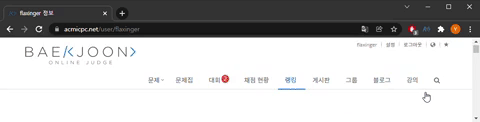

# 1.0.2 버전 패치 노트


## 1. 업데이트(버튼) 과정과 주의 사항( 기여자: [flaxinger](https://github.com/flaxinger) )

기존 1.0.1 버전의 백준허브는 업로드가 안되는 버그부터 파일 누락, 확장자 오류 등 다양한 버그가 있었습니다.</br>
성급하게 출시를 한 것에 대한 결과라고 생각되며, 1.0.2 버전에 [getCurrentThread](https://github.com/getCurrentThread)님의 도움으로 상당 수의 문제를 해결하였습니다.

위 버그의 개선과 더불어 1.0.2 버전은 파일 구조와 Local Storage 구조 등이 변하게 되었는데요, 이렇듯 다양한 변경사항이 있다보니 기존 버전과의 호환성이 다소 떨어지게 되었습니다.</br>
따라서 이러한 변화를 보다 자연스럽게 적용할 수 있도록 업데이트 기능을 추가하였습니다. 이 때 두가지의 옵션이 주어지는데, 이와 관련하여 장단점과 구체적인 동작 과정을 설명하고자 합니다.

우선 업데이트 이후 코드 업로드를 시도하면 다음과 같은 알림이 뜹니다.


이후 아래 `업데이트 실행` 버튼을 누르시면 백준허브로 제출한 문제 목록이 나옵니다.


이때 하단에 주어지는 옵션에 대한 설명은 아래와 같습니다.

### 옵션 1 (동의 후 실행)

옵션 1은 백준허브 전용 레포를 사용하거나, 지금까지 버그를 많이 경험하지 않은 사람, 혹은 직접 레포를 재구성하기에는 그동안 너무 많은 문제를 푼 분에게 유리한 선택지입니다. 다양한 테스팅을 해본 결과 해당 기능으로 놓치는 파일이 전혀 없기는 힘들다는 결론을 내렸습니다. 단, 1.0.2 버전부터 적용된 레포 구조로 인해 이를 정확히 모방하기는 어렵다는 점과, 경로 문자열 처리 방법도 바뀌었다는 점을 고려했을 때 기존 커밋 내역을 유지하면서 업데이트하기에는 나쁘지 않은 전략일 것입니다. 하지만 전체 문제 내역을 업로드 하는 기능이 추가되었고, 180개 기준 최대 30초의 시간이 소요되기에 문제가 되지 않는다면 2번 옵션과 함께 전체 문제 내역을 업로드하는 것을 추천드립니다.

옵션 1의 동작 과정은 다음과 같습니다.

1. 기존에 백준허브를 사용했던 모든 사용자는 버전이 일치하지 않는다는 알림과 함께 업데이트 버튼을 확인하실 수 있습니다.
2. 업데이트 버튼을 누르면 백준허브는 기존에 `백준허브로 푸시한 코드`를 list up 하게 되는데, 이에 대한 기준은 아래와 같습니다.
     * 코드와 README.md 파일이 모두 존재해야합니다
          * 1.0.1 버전에서 코드 혹은 README 파일 누락이 있었다는 점을 인지하고 있지만 백준허브 전용 레포가 아닌 기존에 사용하던 레포를 등록하신 분도 있을 것으로 생각되어 최대한 보수적으로 선택하였습니다.
     * 백준허브 첫 출시일 이후의 코드여야 합니다.
     * 기존 푸시 경로와 일치해야 합니다.
          * 만약 푸시 이후 경로(파일 이름, 위치)를 변경하였다면, 백준허브가 찾지 못합니다.
3. 리스트 업 이후 각 파일을 레포에서 순차적으로 삭제합니다. 
4. 삭제된 각 문제에 대하여 1.0.2 형식에 맞게 파일을 업로드합니다.
5. 업로드 후 로컬 스토리지에 관련 정보(문제 번호, SHA)와 신규 버전 정보를 저장합니다.

옵션 1을 실행 후 정상적으로 레포가 업데이트 되었는지 확인합니다.

실행 전


실행 후


### 옵션 2 (직접 변경)

옵션 2는 옵션 1과 달리 버그를 많이 경험하였거나, 기존 레포에 백준허브를 사용했거나 혹은 백준허브 출시 이후 많은 문제를 풀지 않은 분에게 유리한 전략입니다. 

옵션 2를 선택하게 되면, 옵션 1의 5번에서 문제의 번호, SHA를 저장한 것과 달리 이와 관련된 스토리지 데이터를 초기화합니다. 단 신규버전 정보 또한 바로 적용 되기에 바로 문제 없이 사용하실 수 있습니다. 또한 업로드 기능에 있어서 문제가 없도록 설계하였으나, 제출 내역이 초기화 되었기에 중복 업로드가 발생합니다. 따라서 옵션 2를 선택하신다면 직접 파일 구조를 변경하거나, 새로운 레포지토리를 연결해주셔야 합니다.
</br>
</br>


## 2. 백준 티어 및 디렉토리로 구분하여 코드 저장 ( 기여자: [flaxinger](https://github.com/flaxinger) )

기존 코드 저장은 어떠한 Scheme 없이 단순히 코드를 저장하는 용도였다면, 이제는 백준 및 티어로 구분하여 코드를 저장합니다.</br>
이러한 파일 구조는 향후 프로그래머스, 코드포스 등의 온라인저지 기능 추가에 유리할 것으로 생각되어 적용하였습니다.</br>
기존 이용자분들의 레파지토리를 자동으로 재구축하는 기능 또한 구현되었습니다.

예시
```
백준
 |_ 실버
 |    |_ 2641.다각형그리기
 |         |_ 다각형그리기.cpp
 |         |_ README.md
 |_ 골드
      |_ 1918.후위-표기식
           |_ 후위-표기식.java
           |_ README.md   
```

어떻게 파일을 저장할지에 대해 논의를 한 결과 최종 목표는 파일 경로를 옵션화하는 것으로 설정되었습니다.</br>
향후 백준허브가 사용하는 변수(등급, 언어, 플랫폼, 문제 ID) 등으로 각 사용자가 커스텀 파일 시스템을 구축할 수 있도록 할 예정입니다.</br>
예로 현재 적용되어 있는 경로 형식은 `{user}/{repository}/{플랫폼}/{등급}/{문제번호}.{문제명}/{문제명}.{확장자}`입니다.
</br>
</br>

## 3. 제출 코드 비교 로직 추가 ( 기여자: [flaxinger](https://github.com/flaxinger) )

이제 백준에서 문제를 해결할때마다 비교 함수를 통해 가장 성능이 좋은 코드가 업로드됩니다.

<ol>
 <li>
  비교 로직</br>
  <p>
   코드의 성능은 다양한 기준을 통해 평가될 수 있습니다. 백준허브는 좋은 코드를 실행시간, 메모리 사용량, 코드 길이 순으로 평가하기로 하였습니다. 비교 함수는 아래와 같습니다.</br>
   최근코드 업로드 기능을 개발하며 local storage에 저장되는 데이터의 구조에 변경이 있었습니다. 기존 버전과의 호환을 보장하기 위해 버전 차이가 발견된다면 업데이트 버튼이 생성됩니다. 
   
   ```javascript
   function compareSubmission(a, b) {
     return a.runtime === b.runtime
               ? a.memory === b.memory
                    ? a.codeLength === b.codeLength
                         ? -(a.submissionId - b.submissionId)
                         : a.codeLength - b.codeLength
                    : a.memory - b.memory
               : a.runtime - b.runtime;
     }

   ```

  </p>
 </li>
</ol>
</br>
</br>

## 4. 현재까지 해결한 모든 문제 업로드 기능( 기여자: [getCurrentThread](https://github.com/getCurrentThread) )

Git의 blob, tree 등을 활용하여 효율적으로 다량의 코드를 제출합니다. 다만 Github API의 요청 수가 시간당 5000번으로 한정되어 있고, 하나의 파일당 한번의 요청이 필요하기에 시간당 최대 2500개의 문제만 제출이 가능합니다. 



[결과 레포](https://github.com/flaxinger/BJHTEST-50)
</br>
</br>

## 5. HTTP request 비동기 처리( 기여자: [getCurrentThread](https://github.com/getCurrentThread) )

기존 XHR api를 Fetch api로 리팩토링하였습니다. 기존의 순차적 요청보다 실행시간이 단축되었습니다.
</br>
</br>

## 6. 백준의 모든 언어 지원 ( 기여자: [getCurrentThread](https://github.com/getCurrentThread) )

기존 버전에서 지원되는 언어가 많지 않아 확장자가 'undefined'로 설정되는 사례를 확인하였습니다. 이와 관련하여 이제는 백준에서 제공하는 모든 언어를 지원합니다.
</br>
</br>

## 7. 다른 유저의 코드를 푸시하는 버그 ( 기여자: [getCurrentThread](https://github.com/getCurrentThread) )

기존에 다른 사용자의 코드도 푸시하던 에러를 해결하였습니다.
</br>
</br>

## 8. baekjoon.js 파일 분할( 기여자: [flaxinger](https://github.com/flaxinger) )

백준 업로드 기능을 담당하는 파일을 분할하여 공동작업이 용이하게 하였습니다.</br>
./manifest.json에서 본래 순서대로 로딩되도록 하여 페이지에서는 기존과 동일하게 동작합니다.
````
scripts/baekjoon/variables.js
scripts/baekjoon/storage.js
scripts/baekjoon/parsing.js
scripts/baekjoon/util.js
scripts/baekjoon/uploadfunctions.js
scripts/baekjoon/UpdateForNewVersion.js
scripts/baekjoon/baekjoon.js
scripts/authorize.js
scripts/Github.js
````
</br>
</br>
