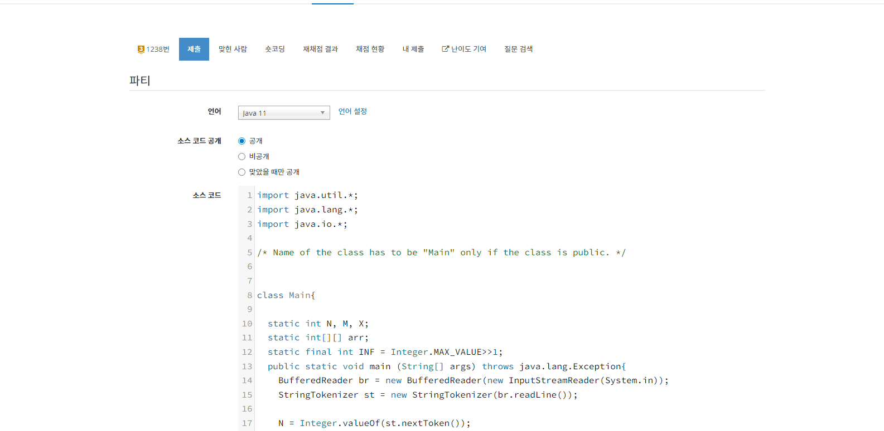
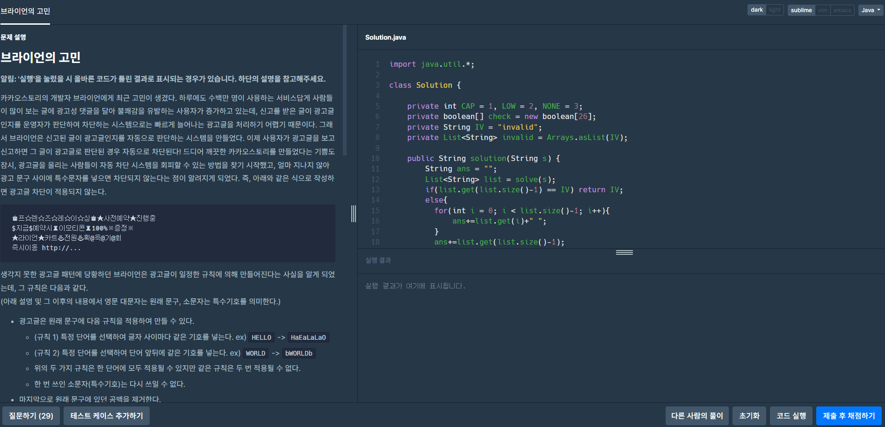

<h1 align="center">
  
   
  BaekjoonHub - Automatically sync your code to GitHub.
   
   
</h1>

  
  
  
    
</a>

 

## Contributors
<!-- ALL-CONTRIBUTORS-LIST:START - Do not remove or modify this section -->
<!-- prettier-ignore-start -->
<!-- markdownlint-disable -->
<table>
  <tr>
    <td align="center"><a href="https://github.com/flaxinger"> <b>flaxinger</b></a> <a href="#maintenance-flaxinger" title="Maintenance">🚧</a></td>
    <td align="center"><a href="https://github.com/mumwa"> <b>mumwa</b></a> <a href="#tool-mumwa" title="Tools">🔧</a></td>
    <td align="center"><a href="https://github.com/getCurrentThread"> <b>getCurrentThread</b></a> <a href="#maintenance-getCurrentThread" title="Maintenance">🚧</a></td>
    <td align="center"><a href="https://xvezda.com"> <b>Xvezda</b></a> <a href="https://github.com/getCurrentThread/BaekjoonHub/commits?author=Xvezda" title="Documentation">📖</a></td>
    <td align="center"><a href="https://github.com/doxxx93"> <b>Doxxx93</b></a> <a href="#talk-doxxx93" title="Talks">📢</a></td>
  </tr>
</table>

<!-- markdownlint-restore -->
<!-- prettier-ignore-end -->

<!-- ALL-CONTRIBUTORS-LIST:END -->

 

## 목차

1. [크롬 마켓](#지금-크롬-마켓에서-확인하세요)
2. [백준허브란?](#백준허브란what-is-baekjoonhub)
3. [설치 및 연동](#설치-및-연동how-to-set-it-up)
4. [작동 원리](#작동원리how-it-works)
   1. [동작 화면](#1-동작-화면)
   2. [업로드 시점](#2-업로드-시점)
   3. [저장되는 정보](#3-저장되는-정보)
5. [링크 및 문서](#링크-및-문서)
    
    

<!--- 마켓  --->

## 지금 크롬 마켓에서 확인하세요!

<!--- 소개 --->

## 백준허브란?(What is BaekjoonHub?)

  백준 허브는 LeetCode의 개인 풀이를 github에 자동 푸시해주는 <a href="https://github.com/QasimWani/LeetHub">LeetHub</a>에서 영감을 받아 만든 프로젝트입니다. <a href="https://www.acmicpc.net/">백준</a>, <a href="https://programmers.co.kr/">프로그래머스</a>를 통해 알고리즘 공부를 하시는 분들이 더욱 쉽게 코드를 저장하고 관리할 수 있게 하도록 만들었으며, 오픈소스 프로젝트로 여러분의 조언과 참여를 환영합니다. 

  BaekjoonHub is a chrome extension that automatically pushes your code to GitHub when you pass all tests on a <a href="https://www.acmicpc.net/">Baekjoon Online Judge</a> problem. This project was based off of <a href="https://github.com/QasimWani/LeetHub">LeetHub</a>, a similar extension for Leetcode.

👉 <a href="https://github.com/flaxinger/BOJAutoPush"> 예시 Repository</a> 보러 가기 

 
 

<!--- 설치 및 연동 --->

## 설치 및 연동(How to set it up)

<ol>
  <li>크롬에서 설치 후 우측 상단의 popup 버튼을 클릭합니다.</li>
  <li>"Authorize with GitHub" 버튼을 누르면 Repository 연동 화면이 표시됩니다.</li>
  <li>신규 혹은 기존의 Repository를 선택하면 BaekjoonHub과 연동이 완료됩니다
    (기본값은 private으로 되어있습니다).</li>
  <li>이후 제출화면이 감지되면 자동으로 업로드됩니다</li>
</ol>
👉 보다 구체적인 사용 방법을 알고 싶다면 다음 <a href="https://velog.io/@flaxinger/백준허브-사용-방법">사용자 매뉴얼</a>을 확인해주세요.
 
 

<!--- 작동 원리 --->

## 작동원리(How it works)

### 1. 동작 화면

백준 동작 화면

 

프로그래머스 동작 화면

### 2. 업로드 시점

 백준허브는 풀이 제출 직후에 작동합니다. 백준은 신규 탭이 일시적으로 사용되고 업로드 후 자동 종료되며 프로그래머스는 제출 화면에서 바로 업로드가 진행됩니다.

### 3. 저장되는 정보

플랫폼 별로 문제 해결 시 파싱 후 저장되는 정보는 다음과 같습니다.

<table>
  <tbody>
    <tr>
      <th>플랫폼</th>
      <th align="center">문제 메타 정보</th>
      <th align="center">사용자 제출 정보</th>
    </tr>
    <tr>
      <td>백준</td>
      <td align="left">
        <li>문제 제목</li>
        <li>문제 아이디</li>
        <li>문제 링크</li>
        <li>문제 등급</li>
        <li>문제 설명</li>
        <li>사용 언어</li>
        <li>문제 분류</li>
      </td>
      <td align="left">
        <li>코드</li>
        <li>사용한 메모리</li>
        <li>실행 시간</li>
      </td>
    </tr>
    <tr>
      <td>프로그래머스</td>
      <td align="left">
        <li>문제 제목</li>
        <li>문제 아이디</li>
        <li>문제 링크</li>
        <li>문제 등급</li>
        <li>문제 설명</li>
        <li>사용 언어</li>
      </td>
      <td align="left">
        <li>코드</li>
        <li>사용한 메모리</li>
        <li>실행 시간</li>
      </td>
    </tr>
  </tbody>
</table>

 
 

<!--- 링크 및 문서 --->
## 링크 및 문서
<table>
  <tr>
    <td align="center">
       <b>버그 신고</b>
    </td>
    <td align="center">
       <b>개발 블로그</b>
    </td>
    <td align="center">
       <b>카카오톡 협업방</b>
    </td>
    <td align="center">
       <b>패치 노트</b>
    </td>
  </tr>
</table>

 
 
